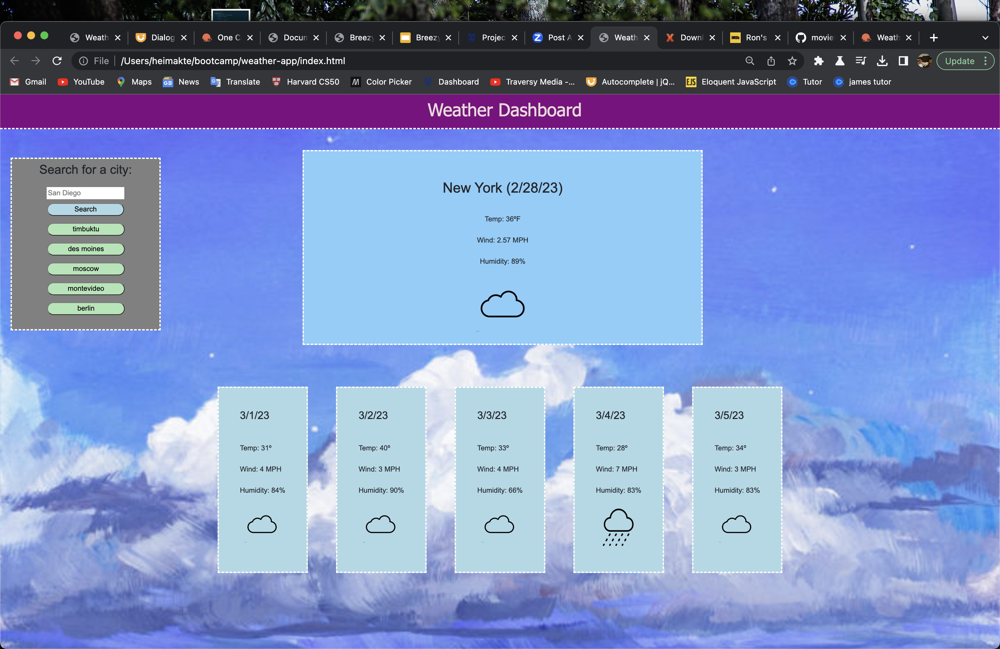

# <Weather-Application>

## Description

This webpage is able to prognosticate and display weather conditions from cities across the world. It was built with HTML, CSS, and Javascript.

## Installation

Installation for this webpage is not necessary, the deployed website can be viewed at: https://moviefan322.github.io/weather-app/

## Usage

Simply naviate to the following URL and look up the city you would like to see the forecast for: https://moviefan322.github.io/weather-app/

## Credits

All code was written by me. The website employs the Open Weather API.

## License

MIT Licence
